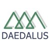

 
<h2>Experience</h2>
 

	<b>Samsung Electronics</b> - hired by Randstad Technologies <i>(Feb. 2018 - current)</i>  
	Developer of core skills from Bixby, a smart assistant to enable voice interaction with Samsung devices. I am working in the area of Natural Language Understanding (NLU). More about Bixby <a href="https://bixbydevelopers.com" target="_blank">here</a>.
	  

	<b>Taiger Spain</b> <i>(Nov. 2016 - Feb. 2018)</i>  
	Natural Language Processing specialist. Development of algorithms for information retrieval from unstructured text. Legal document automation for banks.
	  

	<b>Séntisis Analytics</b> <i>(May 2013 - Oct. 2016)</i>  
	Head of Computational Linguistics. Design and development of core methodologies for opinion and sentiment analysis in social media.
	  

	<b>Daedalus</b> <i>(Oct. 2011 - Feb. 2013)</i>  
	Computational linguist. Machine proofreading applications.
	  

	<b>University of Granada</b> <i>(Jan. 2010 - Jan 2012)</i>  
	PhD research in ontologies and specialized language: <a href="http://ecolexicon.ugr.es/en/index.htm" target="_blank">EcoLexicon project</a>
	  

	<b>Spanish Academy of Language (Real Academia Española)</b> <i>(Apr. 2007 - Nov. 2009)</i>  
	Linguist for dictionary projects: <a href="http://lema.rae.es/damer/" target="_blank">Dictionary of Latin American Spanish</a>
	  

[comment]: Education

 
<h2>Education</h2>
 

	<b>PhD at the University of Granada</b> <i>(Jan. 2010 - Jan 2012)</i>  
	Specialization in Computational Linguistics (ontologies and semantic annotation).  PhD Thesis: <i>Representation of terminological knowledge spread on the web. Study of the climate change domain</i>. Text in Spanish: <a href="https://www.google.com/url?sa=t&rct=j&q=&esrc=s&source=web&cd=1&ved=2ahUKEwiRgejS7NHoAhWGxoUKHZcMD0sQFjAAegQIAxAB&url=https%3A%2F%2Fhera.ugr.es%2Ftesisugr%2F20745539.pdf&usg=AOvVaw3jbJ-I166fkwMiQRaWv0i9" target="_blank">PDF link</a>
	  

	<b>BA in Translation and Interpreting</b> <i>(Sep. 2001 - Jun. 2006)</i>  
	Specialization in Scientific and Technical Translation.
	  

[comment]: Skills

 
<h2>Skills</h2>

	Use of <b>Python</b> language and libraries for Natural Language Processing. 
	Initiated in <b>JavaScript</b>. 
	Able to develop NLP autonomously. 
	  

  