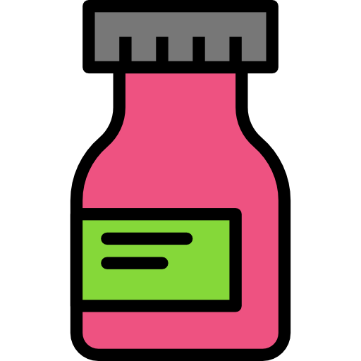

NLP algorithms

<ul style="list-style-type:disc;margin-left:65px;">
<li><a href="#algorithms">Disease-treatment NER (rule-based)</a></li>
<li><a href="#algorithms">Disease-treatment NER (machine learning)</a></li>
<li><a href="#algorithms">Twitter user classifier in healthcare (rule-based)</a></li>
<li><a href="#algorithms">Twitter user classifier in healthcare (machine learning)</a></li>
</ul>

Labeled datasets

<ul style="list-style-type:disc;margin-left:65px;">
<li><a href="#algorithms">Disease-treatment Twitter dataset</a></li>
<li><a href="#algorithms">Disease-treatment PubMed dataset</a></li>
<li><a href="#algorithms">Descriptions from healthcare Twitter users</a></li>
</ul>

Data insights

<ul style="list-style-type:disc;margin-left:65px;">
<li><a href="#algorithms">Lifescope stats</a></li>
</ul>
 

- - -

<b>Disease-treatment Twitter dataset</b> - <i>12 April 2020</i>

                                  
- - -

<a id="algorithms">Puntero del enlace aquí

