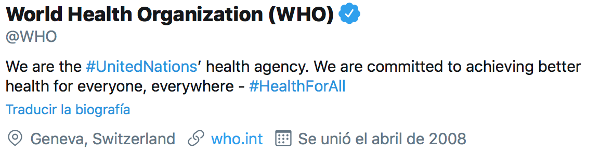
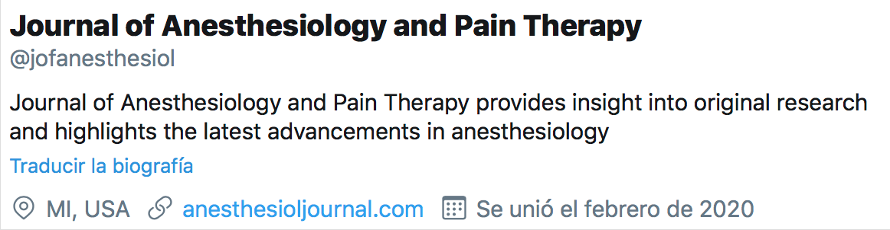

NLP algorithms

<ul style="list-style-type:disc;margin-left:65px;">
<li><a href="#Disease-treatment-NER">Disease-treatment NER</a></li>
<li><a href="#Healthcare-Twitter-User-Classifier">Healthcare Twitter User Classifier</a></li>
</ul>

Labeled datasets

<ul style="list-style-type:disc;margin-left:65px;">
<li><a href="#disease-treatment-corpus">disease-treatment corpus</a></li>
<li><a href="#algorithms">healthcare twitter profiles</a></li>
<li><a href="#algorithms">performance tests</a></li>
</ul>
 

<b>Disease-treatment NER</b> [April 2020]

	
	This is a Named Entity Recognition algorithm to extract named diseases and treatments from sentence-like text.  

	  For the sentence 
	
	<code>
		Favipiravir to treat COVID-19
	</code>  
	NER will return the following 
	<code>
		{ &quot;treatment&quot;: &quot;Favipiravir&quot;, &quot;disease&quot;: &quot;COVID-19&quot; }
	</code>
	  
	Both entities must be semantically related to be well labeled as <i>treatment</i> and <i>disease</i>; otherwise, NER will return an <code>&lt;empty&gt;</code> tag.  
	Consider the following 
	<code>
		Favipiravir can't treat COVID-19
	</code>  
	The result will then be 
	<code>
		{ &quot;treatment&quot;: &quot;&lt;empty&gt;&quot;, &quot;disease&quot;: &quot;COVID-19&quot; }
	</code>  
	The algorithm precision score is 0.89. Performance varies according to text source or style. I used Twitter (healthcare-related tweets) and PubMed (research paper titles) as text sources for training and testing. 

<a href="https://github.com/JuanFF/disease-treatment-NER" target="_blank">repository</a> 
<a href="https://github.com/JuanFF/datasets/tree/master/performance-tests/disease-treatment%20NER" target="_blank">test dataset</a>

  

<b>Healthcare Twitter User Classifier</b> [April 2020]

	This is a text classifier that categorizes user names and descriptions from Twitter users related to healthcare. As Twitter users provide information on themselves in their user names and descriptions, the classifier reads from this data (name, description) to return a descriptive label for each type of user profile.  

	User profile classification may be useful when managing loads of health information on Twitter.  

	In the following example, the classifier will return the label <code>Institution</code> to identify the profile from the World Health Organization.  

  

	The following will return <code>Publication</code> as the label to describe this medicine journal.  

  

	
	In all cases, the classifier must receive the Twitter user name and description as input data. The tag set of healthcare-related profiles is the following: 

<ul style="margin-left: 80px;">
	<li>Academia</li>
	<li>Publishing source</li>
	<li>Doctor</li>
	<li>Professional</li>
	<li>Medical business</li>
	<li>Interested in healthcare</li>
	<li>News source</li>
	<li>Healthcare initiative</li>
	<li>Association</li>
	<li>Generic</li>
</ul>

	The classifier returns <code>&lt;empty&gt;</code> when the input profile doesn't belong to any of these categories.  

	The precision score is 0.86  

	Find the code, instructions and test data in the following links: 

<a href="https://github.com/JuanFF/healthcare-twitter-user-classifier" target="_blank">repository</a> 
<a href="https://github.com/JuanFF/datasets/tree/master/performance-tests/healthcare%20twitter%20user%20classifier" target="_blank">test dataset</a>
  

<b>Corpus disease-treatment</b> [April 2020]

	Find here an annotated corpus of healthcare headlines. It consists of 314620 sentence-like texts that mention one disease and its treatment. For each text, the JSON file encodes this information:  

<pre class="jsonCodeBlock">
{ &quot;message&quot;: &quot;Botox as a treatment for bruxism&quot;,
  &quot;treatment&quot;: &quot;Botox&quot;,
  &quot;disease&quot;: &quot;bruxism&quot;,
  &quot;source&quot;: &quot;twitter&quot;,
  &quot;date&quot;: &quot;2018-04-22&quot;  }
</pre>
	

	 
	<code>treatment</code> and <code>disease</code> are named entities that were automatically labeled using the <a href="#Disease-treatment-NER">disease-treatment NER</a>. The text from <code>message</code> comes from healthcare users' tweets, PubMed paper titles, and titles from studies in ClinicalTrials.gov (as specified in <code>source</code>).  
	
	This is the frequency of each source in corpus 

	This corpus has information from 2018 and 2019. I have been working on it for training and testing the NER algorithm.   
	
	All texts are publicly available on Twitter, PubMed and Clinical Trials. This corpus data is not intended for medical purposes, but for training or evaluating machine learning models.   

<a href="https://github.com/JuanFF/datasets/tree/master/disease-treatment%20corpus" target="_blank">JSON file</a> 
